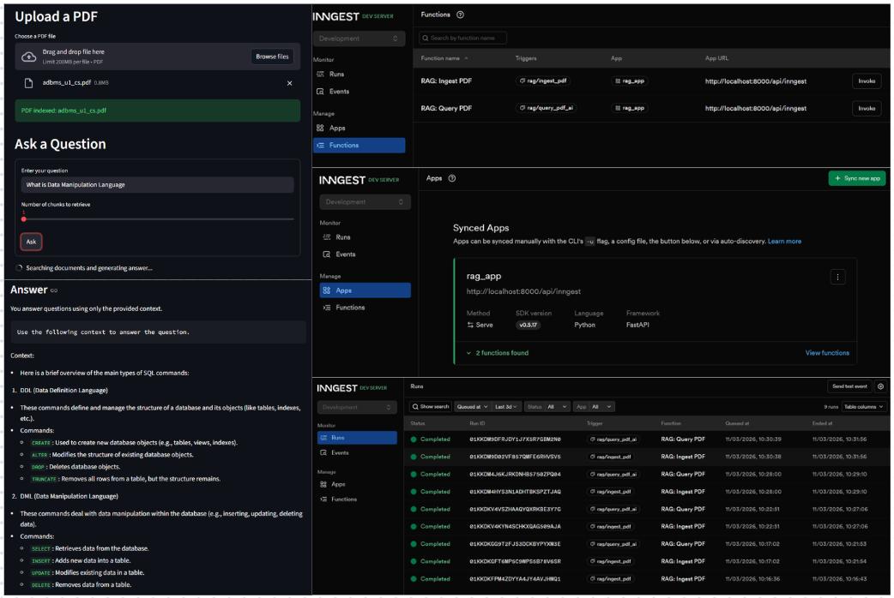

# RAG-Based PDF Assistant

This project implements a **Retrieval-Augmented Generation (RAG)** pipeline that allows users to upload PDF documents and ask natural language questions about their content. The system processes the uploaded documents, converts them into vector embeddings, stores them in a vector database, and retrieves the most relevant information to generate accurate answers.

The application combines **FastAPI, Streamlit, Inngest, HuggingFace models, and Qdrant** to create a complete end-to-end AI-powered document question answering system.

Users can upload PDFs through the web interface and interactively query the documents to retrieve contextual answers along with their sources.

## Features
* Upload and index PDF documents through a user-friendly interface
* Automatic text chunking and embedding generation
* Vector search using a high-performance vector database
* Retrieval-Augmented Generation (RAG) for accurate answers
* Displays sources used to generate answers
* Event-driven workflow using Inngest
* FastAPI backend for scalable processing
* Streamlit interface for easy interaction
* Fully local AI pipeline without requiring paid APIs

## Models Used
The system uses open-source models from HuggingFace for both embeddings and text generation.

### Embedding Model
**BAAI/bge-small-en-v1.5** Used to convert text chunks and queries into vector embeddings for semantic search.

### Language Model
**TinyLlama/TinyLlama-1.1B-Chat-v1.0** Used to generate answers from retrieved document context.

## Architecture and Workflow
This project follows a Retrieval-Augmented Generation (RAG) architecture that allows users to upload PDF documents and ask questions about their content.

The system consists of multiple components that work together to process documents, store semantic representations, and generate answers based on retrieved context.

### 1. User Interface (Streamlit)
The `streamlit_app.py` file provides the web interface where users can:
* Upload PDF documents for indexing
* Trigger the ingestion process
* Ask questions about the uploaded documents
* View generated answers along with the source references

The interface communicates with the backend using events to trigger ingestion and query workflows.

### 2. Backend API and Workflow Orchestration
The `main.py` file contains the FastAPI server and defines the event-driven workflows using Inngest. It handles two main operations:
* **PDF Ingestion Workflow:** Loads and processes the uploaded PDF, generates embeddings, and stores them in the vector database.
* **Query Workflow:** Converts user questions into embeddings, searches the vector database, and sends the retrieved context to the language model to generate an answer.

### 3. Document Processing
The `data_loader.py` module is responsible for:
* Loading PDF files
* Splitting documents into smaller chunks using sentence-based chunking
* Generating vector embeddings for each chunk using the embedding model
* Preparing the data for storage in the vector database

Chunking improves retrieval accuracy by allowing the system to search smaller and more relevant sections of the document.

### 4. Vector Database Operations
The `vector_DB.py` module manages all interactions with the vector database. Its responsibilities include:
* Creating and managing the Qdrant collection
* Storing vector embeddings and metadata
* Performing similarity searches to retrieve the most relevant document chunks for a query

This enables efficient semantic search across large document collections.

### 5. Custom Data Types
The `custom_types.py` file defines structured data models used across the application. These models help standardize the data exchanged between ingestion, retrieval, and query workflows.

### 6. Retrieval-Augmented Generation Process
The overall workflow of the system is as follows:
1.  The user uploads a PDF through the Streamlit interface.
2.  The PDF is processed and split into smaller text chunks.
3.  Each chunk is converted into vector embeddings.
4.  Embeddings are stored in the Qdrant vector database.
5.  When a user asks a question:
    * The question is converted into an embedding.
    * The vector database retrieves the most relevant document chunks.
    * Retrieved context is passed to the language model.
    * The model generates a final answer using the retrieved information.
    * The answer and source references are displayed in the user interface.

The workflow orchestration and event handling are managed using **Inngest**, ensuring reliable and scalable processing of both ingestion and query tasks.

### Screenshot of the UI and Inngest Server


### Run the Project

1. Start Qdrant
`docker start qdrant_DB`

2. Start FastAPI
`uv run uvicorn main:app`

3. Start Inngest
`npx inngest-cli@latest dev -u http://127.0.0.1:8000/api/inngest --no-discovery`

4. Start Streamlit
`streamlit run streamlit_app.py`

## Project Structure
```text
RAG-App
│
├── data_loader.py           # Handles PDF loading, chunking, and embeddings
├── vector_DB.py             # Qdrant vector database operations
├── main.py                  # FastAPI backend and Inngest workflow functions
├── custom_types.py          # Custom data models used across the project
├── streamlit_app.py         # Streamlit UI for uploading PDFs and asking questions
├── ui_&_inngest-server.png  #Screenshot of the Interface and Inngest Server
├── pyproject.toml           # Project dependencies
├── README.md                # Project documentation
├── .gitignore               # Files ignored by Git
└── uv.lock                  # Dependency lock file

